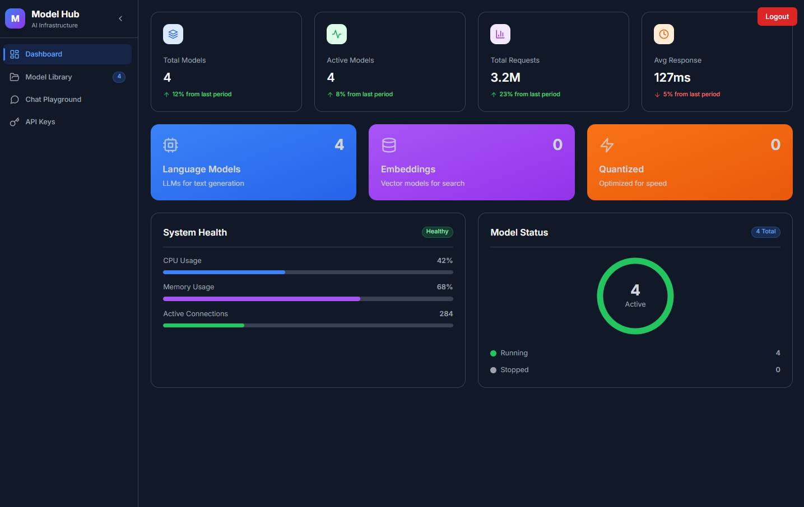
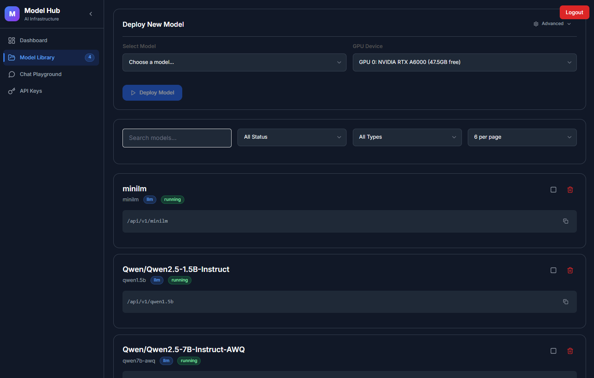
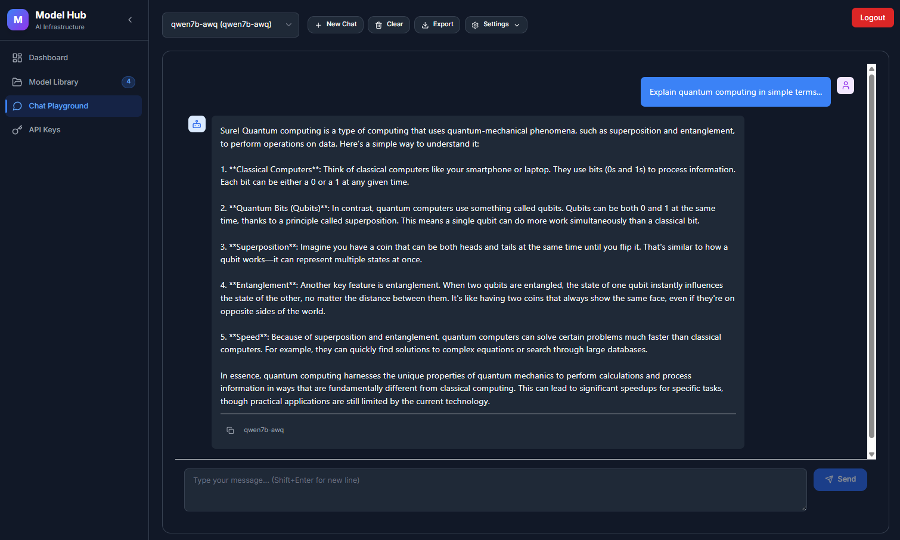
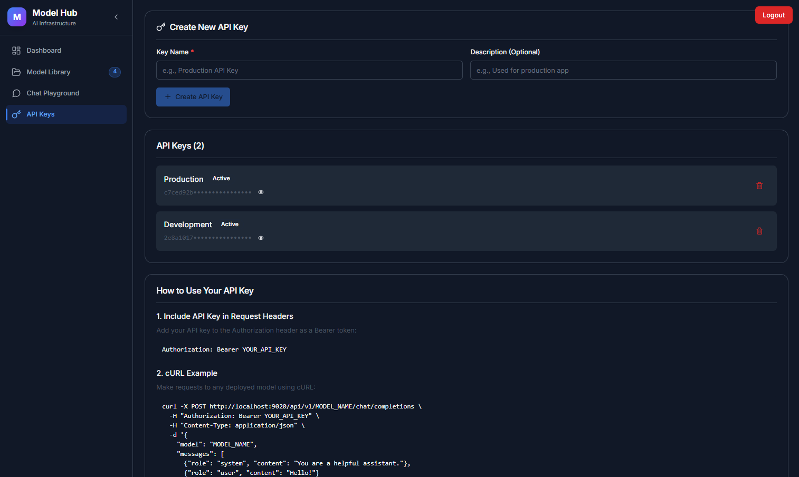

# MIND Platform - Multi-Model LLM Orchestration System

[](https://opensource.org/licenses/MIT)
[](https://www.docker.com/)
[](https://www.python.org/)

MIND (Multi-model Intelligence Network Deployment) is an enterprise-grade orchestration platform for deploying, managing, and serving multiple Large Language Models (LLMs) simultaneously. It provides a unified API interface, intelligent context management, and a user-friendly web dashboard for managing AI model deployments at scale. Built with the help of Claude Code.

## Key Features

### 🎯 Core Capabilities

- **Multi-Model Orchestration**: Deploy and manage multiple LLM models concurrently with automatic resource allocation
- **Smart Context Management**: Intelligent context window optimization prevents token overflow and manages conversation history
- **Production-Ready Infrastructure**: Built-in nginx reverse proxy, Redis state management, and containerized deployments
- **OpenAI API Compatibility**: Full compatibility with OpenAI API specifications for seamless integration
- **Advanced GPU Management**: Multi-GPU support with automatic VRAM optimization and allocation
- **Web Administration Dashboard**: Intuitive UI for model deployment, monitoring, and management
- **Enterprise Authentication**: JWT-based authentication with API key management
- **Real-time Monitoring**: Live metrics for GPU usage, model status, and request performance

### Comparison with Alternatives

| Feature | MIND Platform | Ollama | vLLM | LocalAI |
|---------|--------------|---------|------|---------|
| Multi-model concurrent serving | ✅ Excellent | ❌ Limited | ⚠️ Single model | ✅ Good |
| Web UI Dashboard | ✅ Full admin UI | ❌ None | ❌ None | ⚠️ Basic |
| GPU Management | ✅ Advanced | ⚠️ Basic | ✅ Good | ⚠️ Basic |
| Context Management | ✅ Automatic | ❌ Manual | ❌ Manual | ❌ Manual |
| API Authentication | ✅ JWT+API Keys | ❌ None | ❌ None | ⚠️ Basic |

### Screenshots

<p align="center">
  
  
</p>
<p align="center">
  
  
</p>

## Architecture Overview

```
┌─────────────────────────────────────────────────────────┐
│                   MIND Platform                         │
├─────────────────────────────────────────────────────────┤
│                                                         │
│  ┌─────────────┐     ┌──────────────┐                 │
│  │   Frontend  │────▶│     Nginx    │                 │
│  │   (React)   │     │ Reverse Proxy│                 │
│  └─────────────┘     └───────┬──────┘                 │
│                              │                         │
│                    ┌─────────▼──────────┐              │
│                    │   Orchestrator     │              │
│                    │  (FastAPI + Auth)  │              │
│                    └─────────┬──────────┘              │
│                              │                         │
│        ┌─────────────────────┼─────────────────────┐   │
│        │                     │                     │   │
│  ┌─────▼─────┐        ┌─────▼─────┐        ┌─────▼─────┐
│  │  Model 1  │        │  Model 2  │        │  Model N  │
│  │   (vLLM)  │        │   (vLLM)  │        │   (vLLM)  │
│  └───────────┘        └───────────┘        └───────────┘
│                                                         │
│  ┌─────────────┐                    ┌─────────────┐   │
│  │    Redis    │                    │   MongoDB   │   │
│  │ State Store │                    │   (Future)  │   │
│  └─────────────┘                    └─────────────┘   │
│                                                         │
└─────────────────────────────────────────────────────────┘
```

## Prerequisites

### System Requirements

- **Operating System**: Ubuntu 20.04+ or similar Linux distribution
- **Docker**: Version 20.10 or higher
- **Docker Compose**: Version 2.0 or higher
- **NVIDIA GPU**: CUDA-capable GPU with 8GB+ VRAM (for LLM inference)
- **NVIDIA Container Toolkit**: For GPU support in Docker
- **Memory**: Minimum 16GB RAM (32GB+ recommended)
- **Storage**: 50GB+ free space for model storage

### Software Dependencies

```bash
# Check Docker installation
docker --version
docker-compose --version

# Check NVIDIA GPU and drivers
nvidia-smi

# Verify NVIDIA Container Toolkit
docker run --rm --gpus all nvidia/cuda:11.8.0-base-ubuntu22.04 nvidia-smi
```

## Quick Start

```bash
# Clone the repository
git clone https://github.com/kvsovanreach/mind-llm.git
cd mind-llm

# Copy and configure environment variables
cp .env.example .env
# Edit .env with your settings

# Start all services
./restart-rebuild.sh --all

# Access the dashboard
# Open http://localhost:9020 in your browser
# Default credentials: admin / MindAdmin123
```

## Installation

### 1. Clone and Setup

```bash
# Clone repository
git clone https://github.com/kvsovanreach/mind-llm.git
cd mind-llm

# Set permissions
chmod +x *.sh
```

### 2. Environment Configuration

Create a `.env` file from the template:

```bash
cp .env.example .env
```

Edit `.env` with your configuration:

```env
# Platform Configuration
NGINX_PORT=9020

# Authentication
AUTH_USERNAME=admin
AUTH_PASSWORD_HASH=sha256:salt:hash  # Generate using: python orchestrator/auth.py yourpassword
JWT_SECRET=your-secret-key-here      # Generate using: openssl rand -hex 32
SESSION_TIMEOUT=24

# Optional: HuggingFace token for model downloads
HF_TOKEN=your-token-here

# Redis Configuration
REDIS_HOST=redis
REDIS_PORT=6379

# Environment
ENVIRONMENT=production
```

### 3. Build and Deploy

```bash
# Build all containers
docker-compose build

# Start all services
docker-compose up -d

# Or use the convenience script
./restart-rebuild.sh --all
```

### 4. Verify Installation

```bash
# Check service status
docker-compose ps

# View orchestrator logs
docker-compose logs orchestrator -f

# Test API endpoint
curl http://localhost:9020/orchestrator/health
```

## Configuration

### Model Configuration

Models can be configured through the web UI or by API. Example configuration:

```json
{
  "name": "qwen2.5",
  "model_id": "Qwen/Qwen2.5-7B-Instruct",
  "model_type": "transformer",
  "gpu_index": 0,
  "max_model_len": 32768,
  "config": {
    "temperature": 0.7,
    "top_p": 0.9,
    "max_tokens": 4096
  }
}
```

### Nginx Configuration

Custom routes are automatically generated in `nginx/conf.d/model_routes.conf` when models are deployed.

### GPU Allocation

The platform automatically allocates GPUs based on availability and model requirements. Manual allocation can be specified during deployment.

## Usage

### Web Dashboard

1. **Login**: Navigate to `http://localhost:9020` and login with your credentials
2. **Deploy Models**: Use the Model Manager to deploy new models
3. **Monitor**: View real-time GPU usage and model status
4. **API Keys**: Generate and manage API keys for programmatic access

## API Documentation

### Authentication

All API endpoints require authentication using Bearer tokens:

```bash
# Login to get token
curl -X POST http://localhost:9020/orchestrator/auth/login \
  -H "Content-Type: application/json" \
  -d '{"username": "admin", "password": "MindAdmin123"}'

# Use token in requests
curl http://localhost:9020/orchestrator/models \
  -H "Authorization: Bearer YOUR_TOKEN"
```

### Core Endpoints

#### List Models
```http
GET /orchestrator/models
```

#### Deploy Model
```http
POST /orchestrator/models/deploy
Content-Type: application/json

{
  "name": "qwen2.5",
  "model_id": "Qwen/Qwen2.5-7B-Instruct",
  "gpu_index": 0
}
```

#### Chat Completion
```http
POST /api/v1/{model_name}/chat/completions
Content-Type: application/json
Authorization: Bearer YOUR_API_KEY

{
  "messages": [
    {"role": "system", "content": "You are a helpful assistant."},
    {"role": "user", "content": "Hello!"}
  ],
  "temperature": 0.7,
  "max_tokens": 1000
}
```

### Python SDK Example

```python
from openai import OpenAI

# Initialize client
client = OpenAI(
    base_url="http://localhost:9020/api/v1/qwen2.5",
    api_key="your-api-key"
)

# Make request
response = client.chat.completions.create(
    model="qwen2.5",
    messages=[
        {"role": "system", "content": "You are a helpful assistant."},
        {"role": "user", "content": "Explain quantum computing"}
    ],
    temperature=0.7,
    max_tokens=1000
)

print(response.choices[0].message.content)
```

## Model Management

### Deployment Best Practices

1. **Start with smaller models** (1.5B-3B parameters) to test your setup
2. **Monitor VRAM usage** during deployment to avoid OOM errors
3. **Use quantized models** for better resource efficiency
4. **Configure appropriate context windows** based on your use case
5. **Implement request queuing** for high-traffic scenarios

### Model Configuration Examples

#### Small Model (Qwen 1.5B)
```json
{
  "name": "qwen1.5b",
  "model_id": "Qwen/Qwen2.5-1.5B-Instruct",
  "max_model_len": 8192,
  "gpu_memory_utilization": 0.5
}
```

#### Large Model (Llama 70B with quantization)
```json
{
  "name": "llama70b",
  "model_id": "meta-llama/Llama-2-70b-chat-hf",
  "quantization": "awq",
  "tensor_parallel_size": 2,
  "max_model_len": 4096
}
```

## Security

### Current Security Features

- JWT-based authentication with configurable expiration
- API key management for service-to-service communication
- Password hashing using PBKDF2-SHA256
- Container isolation for each model
- Environment variable configuration for secrets

### Security Best Practices

1. **Change default credentials** immediately after installation
2. **Use strong JWT secrets**: Generate with `openssl rand -hex 32`
3. **Enable HTTPS** in production environments
4. **Implement rate limiting** for API endpoints
5. **Regular security updates** of all containers
6. **Monitor access logs** for suspicious activity
7. **Use environment variables** for all secrets
8. **Implement network segmentation** in production

### Known Security Considerations

- CORS currently allows all origins (restrict in production)
- No built-in rate limiting (implement at nginx level)
- API keys stored in localStorage (consider httpOnly cookies)
- Basic password hashing (consider upgrading to Argon2)

## Contributing

We welcome contributions!

## License

This project is licensed under the MIT License - see the [LICENSE](LICENSE) file for details.

## Acknowledgments

- Built with [vLLM](https://github.com/vllm-project/vllm) for high-performance inference
- UI components from [shadcn/ui](https://ui.shadcn.com/)
- Inspired by the need for enterprise-grade LLM orchestration

---

**Note**: MIND Platform is under active development. Features and APIs may change. Please report any issues or suggestions through GitHub Issues.